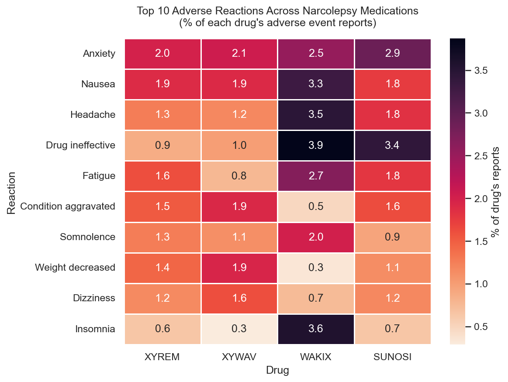

# openFDA Drug Events Mini-Warehouse

A local data engineering project that pulls FDA adverse event reports for narcolepsy medications, runs them through a raw → warehouse → gold pipeline in DuckDB, and compares reaction profiles across the four FDA-approved drugs in the space.



## Why I built this

I'm a Master's student in BU's Data Science program with a non-CS background, coming up on a potential co-op at a pharma R&D team. My coursework covers SQL and databases at a conceptual level, but I wanted hands-on experience actually building an end-to-end pipeline against real pharma data before sitting down with a data engineer.

This project is that practice: public data, real schema messiness, a deliberate warehouse/gold split, and a small focused analysis at the end. The goal is not to produce a novel finding, it's to show that I can take data from an API all the way to a clean analysis-ready layer and know why each step exists.

## Architecture

Three layers, modeled loosely after the medallion pattern.

```
openFDA API
      │
      ▼
  ┌──────────────────────────┐
  │  raw_adverse_events      │   immutable JSON blobs,
  │  (raw layer)             │   one row per report
  └──────────────────────────┘
      │   SQL cleaning
      ▼
  ┌──────────────────────────┐
  │  warehouse_adverse_events│   flattened, filtered to
  │  (warehouse layer)       │   target drugs, one row per
  └──────────────────────────┘   report-drug-reaction combo
      │   normalization
      ▼
  ┌──────────────────────────┐
  │  gold_drugs              │   anchor (stable drug info)
  │  gold_reports            │   reports (time-sensitive)
  │  gold_reactions          │   reactions (fact table, FKs)
  │  gold_analysis_view      │   joined ML-ready view
  │  (gold layer)            │
  └──────────────────────────┘
      │   pandas via con.execute(...).df()
      ▼
   analysis notebook
```

The whole thing lives in a single DuckDB file under `data/warehouse.duckdb`. Pandas reads from the gold view for the final analysis.

## Tech stack

- **Python 3.12** with `requests` for API calls, `pandas` for analysis, `matplotlib` + `seaborn` for visualization
- **DuckDB** as an embedded local database. Handles JSON extraction, flattening, normalization, and all SQL cleaning
- **Jupyter** for the analysis notebook
- **Git / GitHub** for version control

No cloud services, no Docker, no orchestration tooling. Everything runs on a MacBook Air with `python ingest.py` followed by `python run_sql.py`. Keeping the stack small was deliberate: the point was to understand the pattern, not to manage infrastructure.

## Key finding

The four drugs have visibly distinct adverse reaction profiles (see heatmap at the top):

- **Wakix** (pitolisant) is the clear outlier with elevated headache, insomnia, nausea, and drug ineffective reports, consistent with its different mechanism of action (histamine H3 receptor antagonist) compared to the oxybate family.
- **Xyrem and Xywav** look similar to each other, which is expected since they're both sodium oxybate formulations from the same manufacturer. Xywav is the lower-sodium reformulation.
- **Sunosi** (solriamfetol) shows the highest rates of anxiety and drug ineffective reports.

None of this is a novel clinical finding, but the fact that the pipeline surfaces clinically plausible patterns without cherry-picking is the right sanity check. If the output had shown random noise or Xyrem with zero sleep-related reactions, something upstream would be broken.

## How to reproduce

Clone the repo, set up a virtual environment, install dependencies, and run the three commands in order.

```bash
git clone git@github.com:jonaire-tate/openfda-mini-warehouse.git
cd openfda-mini-warehouse

python3 -m venv .venv
source .venv/bin/activate
pip install duckdb requests pandas jupyter ipykernel matplotlib seaborn

# 1. Pull ~2,000 adverse event reports from openFDA (takes ~60 seconds)
python ingest.py

# 2. Build the warehouse layer
python run_sql.py sql/02_warehouse.sql

# 3. Build the gold layer
python run_sql.py sql/03_gold.sql
```

Then open `notebooks/analysis.ipynb` in Jupyter or VS Code, select the `.venv` kernel, and run all cells.

The raw JSON pulls and the `.duckdb` file are gitignored (they're regeneratable), so reproducing the data locally means running `ingest.py` at least once.

## What I learned

Building this surfaced a few things that conceptual coursework alone doesn't teach:

**APIs have personalities.** openFDA returns a 404 when you paginate past the last record instead of an empty list. Figuring that out was five minutes of confusion followed by one extra conditional. Real systems are full of these small quirks, and the first thing a new data engineer does on the job is discover them.

**The raw layer pays for itself.** I had to redo the warehouse SQL three times during Phase 2 (date parsing, filtering out non-target drugs, stripping trailing punctuation from drug names). Each time, I rebuilt the warehouse table from the existing raw layer instead of re-hitting the API. Understanding *why* the raw layer exists was abstract before; after doing this, it's obvious.

**Sanity checks catch real bugs.** My first warehouse run produced 98,973 rows when I expected ~10,000. The number was wrong because every FDA report lists every drug the patient was on, not just the narcolepsy drug that matched the search. Without the row-count sanity check, I would have built the gold layer on top of broken data and only discovered it much later, if at all.

**Normalization is easier to feel than to describe.** Reading about first/second/third normal form in a DX604 textbook is abstract. Actually splitting a wide table into `gold_drugs` (anchor), `gold_reports` (time-sensitive), and `gold_reactions` (fact table with foreign keys) made the pattern click. The wide warehouse table is easy to query but a pain to update; the normalized gold tables are the opposite. Picking the right shape depends on what the data is for.

**AI-assisted code still needs verification.** Claude helped me scaffold the SQL, but the first draft of the warehouse query had bugs that only showed up when I ran the sanity checks. A classmate in my program hit a more painful version of this in his own capstone, where an AI-generated SQL join mismatched on address formatting and cost him real time downstream. The lesson isn't "don't use AI," it's "verify every non-trivial output against the actual data, not against how confident the code looks."

## Limitations and what's next

A few honest scope caveats:

- **Small sample.** Only 2,000 reports per drug (the max is capped in `ingest.py` via `MAX_PER_DRUG`). For a real pharmacovigilance analysis, you'd want every record openFDA has.
- **Drug-name standardization is simplistic.** The warehouse layer normalizes drug names by taking the first whitespace-separated token and stripping trailing punctuation. That works for the four target drugs here, but it's not a general solution.
- **No deduplication of reports.** openFDA can contain multiple versions of the same safety report over time (follow-ups, amendments). This project treats them as distinct.
- **No tests.** A production pipeline would have unit tests for the SQL transformations and integration tests for the full flow. I skipped tests deliberately to keep the scope manageable, not because they're unnecessary.
- **No orchestration.** The three pipeline stages are three separate manual commands. In production this would be a DAG in Airflow, Prefect, Dagster, etc.

If I keep extending this, the obvious next steps are (a) unit tests on the SQL, (b) a proper drug-name resolver, and (c) orchestration via something lightweight like Prefect.